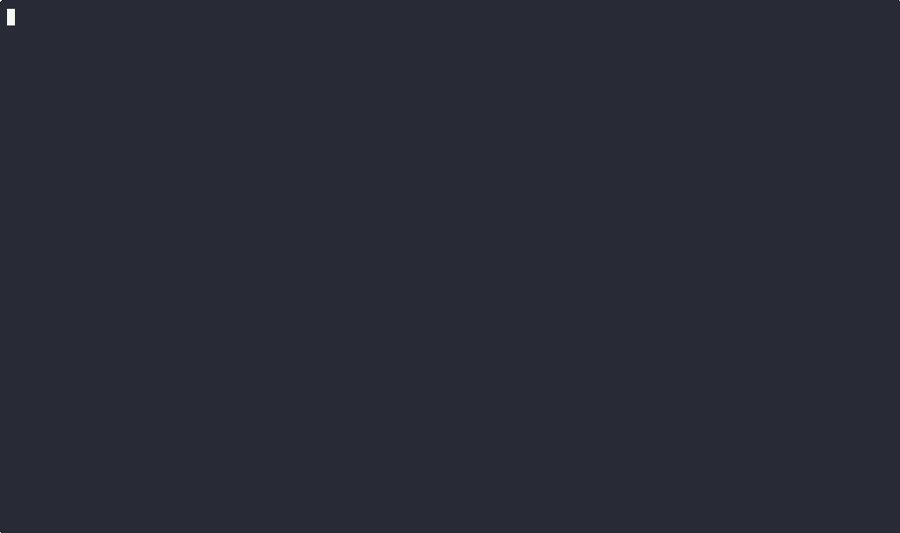

# Seed Data Encryption, decryption and BIP85 Scripts

Welcome to the **Seed Data Encryption and Decryption Scripts** repository! This project contains three powerful Bash scripts designed to encrypt, decrypt, and derive mnemonic phrases from seed data files. The scripts leverage GPG (GNU Privacy Guard) for encryption and decryption, bipsea (https://github.com/akarve/bipsea) for BIP85 derivation (officially recognized by the BTC community : https://github.com/bitcoin/bips/blob/master/bip-0085.mediawiki) and qrencode (https://linux.die.net/man/1/qrencode) for generating QR codes.



## Scripts Overview

### 1. `encrypt.sh`

This script encrypts a seed using GPG with AES256 encryption and generates an output file.

#### Usage
```bash
./encrypt.sh -o path/to/output_file
```

#### Options
- `-o <output_path>`: Specify the output file path (required).
- `-h`: Display help message.

#### How It Works
1. **Prompt for Seed and Password**: The script prompts the user for the seed and password securely, and confirms the password to ensure it matches.
2. **Encrypt Seed**: It uses GPG with AES256 encryption to encrypt the seed with the provided password.
3. **Output File**: The script outputs the absolute path of the encrypted file.
4. **Security Measures**: The script clears the terminal and removes the scrollback buffer to ensure security, and securely erases the password from memory. It also sets appropriate permissions for the output file and logs the file type.


### 2. `decrypt.sh`

This script decrypts a seed data file using GPG and generates a QR code from the decrypted mnemonic.

#### Usage
```bash
./decrypt.sh -f path/to/seed_data_file
```

#### Options
- `-f <seed_path>`: Path to the seed data file (required).
- `-h`: Display help message.

#### How It Works
1. **Prompt for Password**: The script securely prompts the user for a password.
2. **Decrypt Data**: It uses GPG to decrypt the specified seed data file with the provided password.
3. **Generate QR Code**: If decryption is successful, the script generates a QR code from the decrypted mnemonic.
4. **Security Measures**: The script clears the terminal and removes the scrollback buffer to ensure security, and securely erases the password from memory.

### 3. `bip85.sh`

This script decrypts a seed data file, derives a mnemonic phrase, and generates a QR code from the derived mnemonic.

#### Usage
```bash
./bip85.sh -f path/to/seed_data_file -n number_of_words -i index
```

#### Options
- `-f <seed_path>`: Specify the path to the seed data file (default: `/tmp/seed.data`).
- `-n <num_words>`: Specify the number of words for the mnemonic (default: 12).
- `-i <index>`: Specify the index (required).
- `--help`: Display help message.

#### How It Works
1. **Prompt for Password**: The script securely prompts the user for a password.
2. **Decrypt Data**: It uses GPG to decrypt the specified seed data file with the provided password.
3. **Derive Mnemonic**: The script uses `bipsea` commands to validate the decrypted data and derive a mnemonic phrase based on the specified number of words and index.
4. **Generate QR Code**: If mnemonic derivation is successful, the script generates a QR code from the derived mnemonic.
5. **Security Measures**: The script clears the terminal and removes the scrollback buffer to ensure security, and securely erases the password from memory.


## Docker

You can run these scripts inside a Docker container without network access:

- **Build Image**:
  ```bash
  docker build -t imageName .
  ```

- **Run Container Without Network Access**:
  ```bash
  docker run --rm -it --net=none imageName /bin/bash
  ```
  Or use the image built from this repository:
  ```bash
  docker run --rm -it --net=none ghcr.io/comassky/bipsea-scripted:main /bin/bash
  ```

- **Persist Seed Data**:
  You can mount a volume to `/tmp` to persist `seed.data`.

- **Use Scripts**:
  Use the scripts as previously described.

## Dockerfile Explanation

This Dockerfile sets up a lightweight Python environment using Alpine Linux, installs necessary dependencies, and prepares the container to run bash scripts.

### Steps:

1.  **Base Image**:
    
    -   The Dockerfile starts by using the official Python base image with Alpine Linux (`python:alpine`). Alpine is chosen for its minimal size and efficiency.
2.  **Working Directory**:
    
    -   It sets the working directory to  `/app`  using the  `WORKDIR`  instruction. This is where all subsequent commands will be executed.
3.  **Copy Scripts**:
    
    -   The  `COPY`  command copies three scripts (`bip85.sh`,  `decrypt.sh`,  `encrypt.sh`) from the local machine to the  `/app`  directory in the container.
4.  **Install Dependencies**:
    
    -   The  `RUN`  command updates the package list and installs several dependencies:
        -   `bash`: A Unix shell.
        -   `gpg`  and  `gpg-agent`: Tools for encryption and decryption.
        -   `libqrencode-tools`: Tools for QR code generation.
        -   `file`: A utility to determine file types.
    -   Additionally, it installs the  `bipsea`  Python package using  `pip`.
5.  **Default Command**:
    
    -   The  `CMD`  instruction sets the default command to  `bash`, ensuring that the container runs a bash shell when started.

## Contributing

Contributions are welcome! Please fork the repository and submit a pull request.

## License

This project is licensed under the MIT License. See the LICENSE file for details.

## Acknowledgements

- GPG (https://github.com/gpg/gnupg)
- qrencode (https://linux.die.net/man/1/qrencode)
- bipsea (https://github.com/akarve/bipsea)
  

## Buy Me a Coffee

If you enjoy my work and would like to support me, you can buy me a coffee using the following crypto addresses:

- **BTC:**     bc1qeu0867ep8u4ursf6sfp3gwq87qx55sq5dms0rj
  
- **ETH/BSC:**    0x0f26B8Bdc028F6bd0F79FF4959306065C36d5EAa

- **SOL:**    64NUvVYMwwnchsTYwbWboGfyez4j7dGsJnB1eiWZhbkm

- **Lightning:** <br/><br/> <p align="center">

</p>
